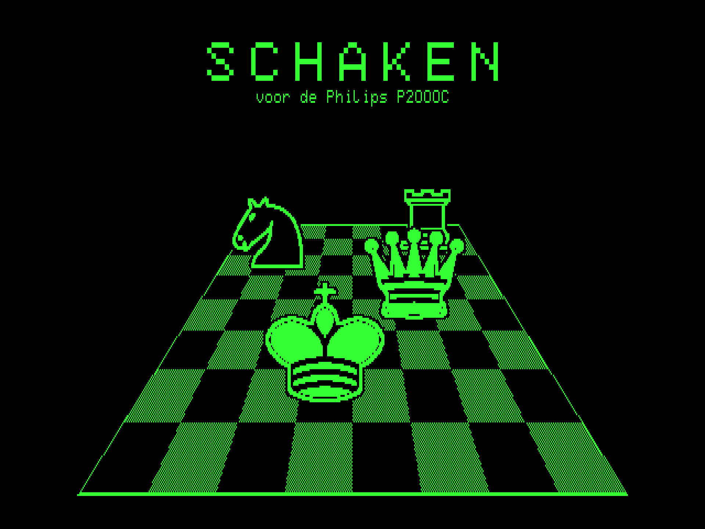
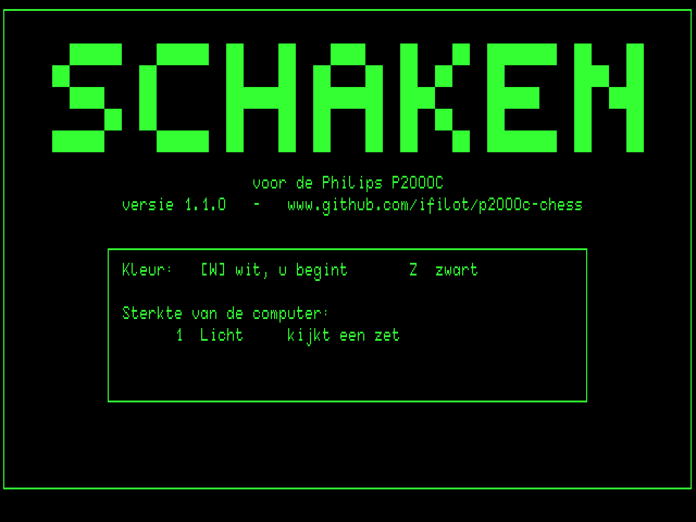
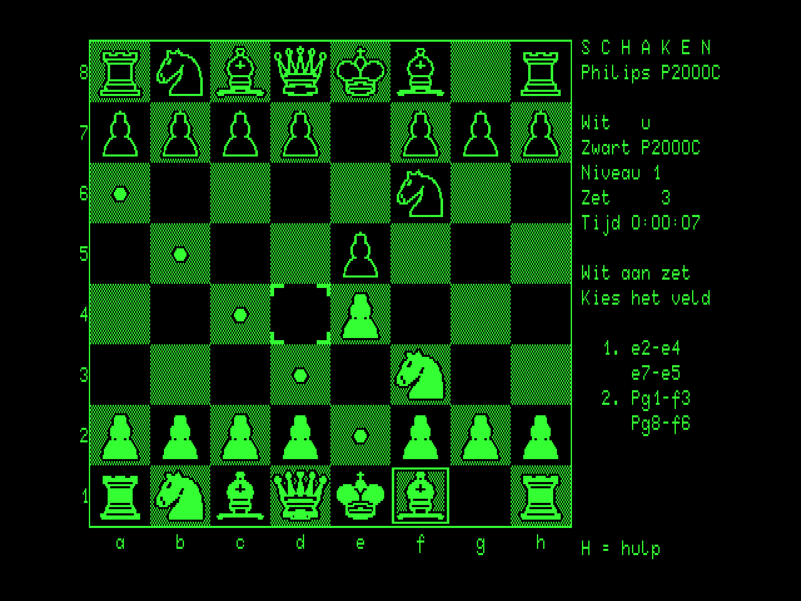
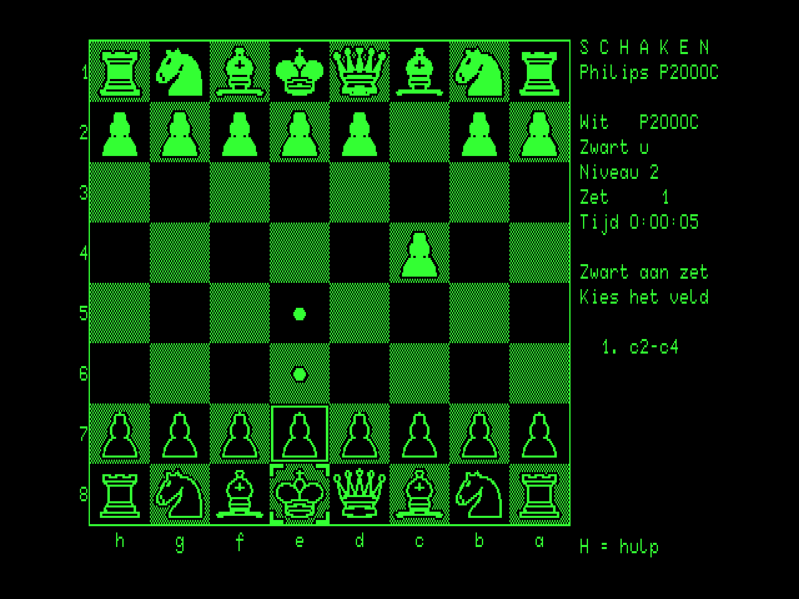
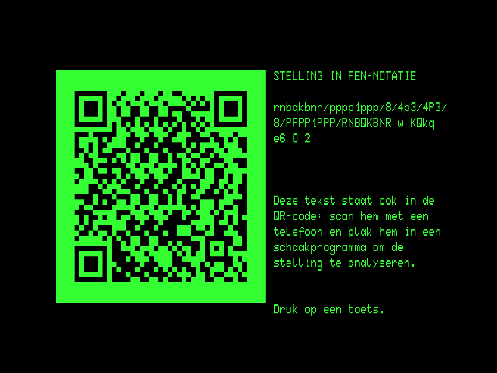

# Schaken (chess) for the Philips P2000C

[](https://github.com/ifilot/p2000c-chess/actions/workflows/build.yml)
[](https://github.com/ifilot/p2000c-chess/releases)
[](LICENSE)

Chess against the computer for the Philips P2000C running CP/M. The board
is drawn in the terminal board's 512x252 high-resolution graphics mode, and
the text plane carries the panel with the clock and the last moves. The
user interface is in Dutch. You choose your colour and one of three levels
at the start.

> [!NOTE]
> **More P2000C games:** Check out [Battleship](https://github.com/ifilot/p2000c-battleship),
> [Minesweeper](https://github.com/ifilot/p2000c-minesweeper),
> [Othello](https://github.com/ifilot/p2000c-othello), and
> [Tetris](https://github.com/ifilot/p2000c-tetris). For an all-in-one setup
> containing all five games, see the [P2000C ZuluBlaster SASI drive distribution](https://github.com/ifilot/p2000c-zulublaster-sasi-drive).

<p align="center">
  
  
</p>
<p align="center">
  
  
</p>
<p align="center">
  
</p>

## Play

Download `SCHAKEN.COM` and `SCHAKEN.GFX` from the [releases](https://github.com/ifilot/p2000c-chess/releases)
(or the latest [build artifact](https://github.com/ifilot/p2000c-chess/actions)), copy both
to the same CP/M disk and run `SCHAKEN`. `SCHAKEN.GFX` holds the piece
drawings and the title picture; the program looks for it on the current
drive and on every drive already in use, so `F:SCHAKEN` from `A>` works too.
With a ZuluBlaster/SASI setup, `make deploy` produces `build/HD1_256.hda`, a
second-disk image in the standard split layout with the game on F:. Copy it
to the SD card in place of the distribution's `HD1_256.hda` and run
`F:SCHAKEN`.

The start screen (plain text, so it appears instantly) asks for your
colour, `W` (White, you begin) or `Z` (Black; the board is turned so your
pieces are at the bottom), and `1`, `2` or `3` starts the game at that
level.

Moving is done with a cursor on the board. As soon as the cursor rests on
one of your pieces, the squares it can go to are marked: a dot on an empty
square, corner wedges on a piece it can capture. RETURN picks the piece up
(a frame appears round it); RETURN on a marked square plays the move. Only
legal moves are ever marked, so castling is simply moving the king two
squares (the rook follows), and en passant the pawn's diagonal step. A pawn
reaching the last rank asks for the piece: `D`ame, `T`oren, `L`oper or
`P`aard (RETURN takes the queen).

| Key | Action |
| --- | --- |
| Cursor keys or `W` `A` `S` `D` | Move the cursor |
| `RETURN` or space | Pick up the piece under the cursor; play it to a marked square |
| `RETURN` on the piece again, or `ESC` | Put it down |
| `T`, `BS` or `DEL` | Take back your last move and the computer's reply |
| `F` | The position as FEN text and QR code (see below) |
| `H` | Help screen with the rules (plain text mode) |
| `D` (start screen) | Demo: the computer plays itself (level 2 against level 3); any key stops it |
| `N` | Back to the start screen for a new game |
| `Q` | Quit, after confirmation (immediate on the start screen) |

The full rules apply: castling, en passant, promotion to any piece, check,
checkmate and stalemate, and draws by the fifty-move rule, by threefold
repetition and when neither side can mate. The panel shows the move number,
the elapsed time, the status (whose turn it is, check, the result) and the
last four moves of each side in long notation with the Dutch piece letters
(`Pg1-f3`, `e4xd5`, `O-O`, `e7-e8D`, `+` check, `#` mate). After five
minutes without a keypress a screen saver blanks the picture; any key
brings it back.

The terminal board finds keys through the video refresh, and while it is
busy with picture data it can take a key that is still held down for a
second press, most of all in graphics mode. Such a copy comes while the
finger is still on the key, so the program ignores the same key when it
arrives within a third of a second of the previous one. A key held down
longer repeats about three times a second. Built with
`make build EXTRA=-DKEY_TRACE`, the note row in the panel shows every key
as it comes in: its code in hex, the 60 Hz ticks since the previous key,
and a `-` when it was ignored.

### Position as FEN and QR code

`F` shows the current position in [Forsyth-Edwards Notation](https://en.wikipedia.org/wiki/Forsyth%E2%80%93Edwards_Notation)
(FEN), the standard one-line description of a chess position that every
chess program and site can import, next to a QR code holding the same text.
Scan it with a phone and paste it into an analysis board (on lichess.org,
for instance) to look at the game further. The code is a version-5 QR code
(37x37 modules) with modules of 6 dots by 4 lines, square on the CRT, dark
on a lit background as on paper. Drawing it takes about two seconds; any
key returns to the board (redrawn in about three and a half).

### Levels

All levels open from a small book of main lines, and choose at random among
moves of (nearly) equal value, so games vary.

| Level | Search | Time per move (4 MHz) |
| --- | --- | --- |
| 1 *licht* | one move ahead plus exchanges, picks among moves within 0.4 pawn of the best | under a second |
| 2 *normaal* | two moves ahead plus exchanges | about a second |
| 3 *zwaar* | deepens (usually to three or four moves) until about 10 seconds are spent | up to 10 s |

The engine is an alpha-beta search with iterative deepening, a capture
search at the leaves, check extensions, killer moves and most-valuable-
victim ordering; the evaluation is material, piece-square tables, king
safety or centralisation depending on the phase, and a mop-up term that
drives a lone king to the edge. Repeated positions count as draws inside
the search.

## Build

The program is C (Z88DK/sdcc) with the display driver and the hot paths of
the rules (move generation, the attack test, making and taking back moves)
in Z80 assembly. It is compiled with the `z88dk/z88dk` Docker image:

```sh
make build            # -> build/SCHAKEN.COM and build/SCHAKEN.GFX
```

The rules and the engine are also plain C that compiles natively, which the
first two checks use (gcc); the other targets use the sibling checkouts
[p2000c-cpm-disk-tool](https://github.com/ifilot/p2000c-cpm-disk-tool)
(headless emulator, CP/M disk images) and
[p2000c-emulator](https://github.com/ifilot/p2000c-emulator) (graphical
emulator, character-ROM font):

```sh
make perft              # move generator against the published perft counts (native)
make selfplay           # engine games on the host
make qrtest             # FEN of random games against the rules model, QR codes through a decoder
make zperft             # perft on the Z80 with rules.asm, in the headless emulator
make test               # games against the computer in the headless emulator
make run                # open the game in the graphical emulator (WSLg/Linux)
make screenshot         # plain raster dump (green on black) -> build/board.png
make deploy             # build/HD1_256.hda: second SASI disk with the game on F:
make sprites            # regenerate the two parts of SCHAKEN.GFX (needs rsvg-convert)
python3 tools/bench.py  # emulated thinking time per level
```

`make test` plays with the cursor keys like a player would, reads the
computer's moves from the panel and checks every one, the move list and the
result against a separate rules model (`tools/chessmodel.py`); it also opens
the FEN page and checks the text and, read back from the emulated screen,
the QR code. The QR checks need the `zxing-cpp` Python module
(`pip install zxing-cpp`); without it they are skipped.

## Layout

| File | Contents |
| --- | --- |
| `src/main.c` | Program flow: data file, title picture, start screen, games |
| `src/game.c`, `src/game.h` | Game state, the cursor interface, turns, take-backs, the demo |
| `src/screen.c`, `src/screen.h` | Board picture: composing squares in the framebuffer and uploading what changed |
| `src/panel.c`, `src/panel.h` | Status panel and move list on the text plane |
| `src/screens.c`, `src/screens.h` | Start and help screens (text mode), title picture, FEN page |
| `src/chess.c`, `src/chess.h` | Rules: 0x88 board, incremental score and Zobrist key, repetitions, draws (C versions of the assembly for the native tools) |
| `src/rules.asm` | Move generation, the attack test, making and taking back moves |
| `src/cpu.c`, `src/cpu.h` | Computer player: search, evaluation, opening book |
| `src/qr.c`, `src/qr.h` | QR code encoder (version 5-L, byte mode) for the FEN page |
| `src/gfx.c`, `src/gfx.h` | Loads `SCHAKEN.GFX` via the BDOS |
| `src/memory.asm` | The big buffers (board, framebuffer, search stacks, bitmaps), placed past the program |
| `src/clock.c`, `src/saver.c` | Game clock from the BIOS 60 Hz timer; screen saver |
| `src/video.asm`, `src/video.h` | Framebuffer primitives, `ESC r` row uploads, BIOS and BDOS calls |
| `src/sprites.bin`, `src/sprites.h` | Generated bitmaps (first part of `SCHAKEN.GFX`) and their offsets |
| `src/splash.rle`, `src/splash.h` | Generated run-length title picture (second part of `SCHAKEN.GFX`) |
| `tools/` | Generators, emulator launchers, screenshot, tests, perft, self-play, benchmark |
| `tools/pieces/` | The piece drawings (SVG) |

## License

GNU General Public License v3.0; see [LICENSE](LICENSE). The piece drawings
in `tools/pieces/` are by Colin M.L. Burnett (Wikimedia Commons, GFDL/BSD/GPL),
used under the GPL. The character-ROM font sheet used by the tooling belongs
to the [p2000c-emulator](https://github.com/ifilot/p2000c-emulator) project.
